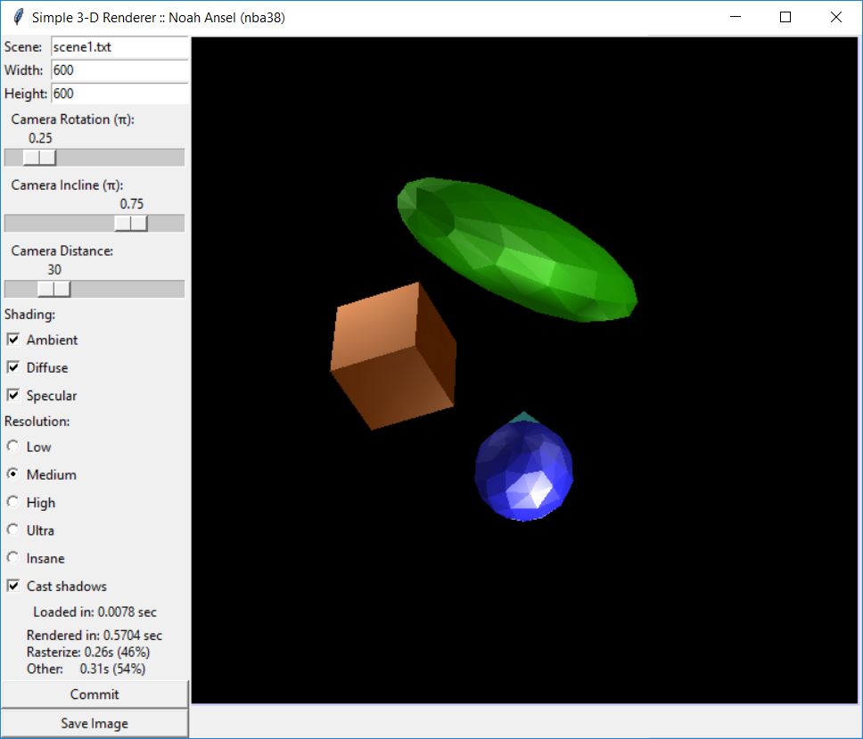

# README

This program was written in Python 3.5.2 and developed in a 64-bit Windows 10 environment. It uses the tkinter, numpy, math, and Pillow libraries.

## Contents

1. Compiling & Running
2. Usage
3. Scene Language
4. Tips

## Compiling & Running

In addition to Python 3.5.2, this program requires Pillow, a branch of the PIL library. On Windows, this can be installed by typing `python -m pip install pillow` in the command prompt.  It may be necessary for you to add the location of your Python installation to the `PATH` environment variable. For more information on installation, visit http://pillow.readthedocs.io/en/3.1.x/installation.html.

Unzip this archive into the desired folder. You will most likely want to use a fresh folder since the program can generate more files. To run the program, open *final_project.py*. If errors are printed without the screen opening, you are missing files or libraries.

## Usage

After initialization, the program should somewhat resemble the image below.

The *Scene* entry specifies the filepath of the scene to be rendered. Pressing the Enter key here will load the new scene. Several sample scenes are provided in this archive. The *Width* and *Height* entries specify the size of the rendered image. Pressing the Enter key here will re-render the image. The *Camera Rotation* and *Camera Incline* sliders specify the camera's viewing direction, and *Camera Distance* specifies the camera's distance from the origin. The camera always faces towards the origin.

The *Shading* options specify what portions of the Phong illumination model are used when rendering the scene. Any combination may be used. The *Resolution* options specify the number of triangles to use when rendering models. Beware: the *Insane* option uses 3,072 triangles per cube and 12,096 triangles per sphere and takes a significant amount of time to render scenes. The *Realistic* option usually takes 2+ minutes to render. The *Cast shadows* checkbox specifies whether objects should cast shadows. Disabling this may improve performance, particularly with complicated scenes.

The *Commit* button re-loads and renders the scene. The *Save Image* button saves the current image under the program's directory with the name `generated_imageX.png`, where X is the lowest unused image number.

## Scene Language

Scenes are defined in text files like the example below.

    # This is a comment
    cube   2  1.0,0.4,0.0  1,1,1    -1,3,-1  3*pi/8,-pi/4
    sphere 2  0.2,1.0,0.0  0.5,1,2  1,1,2    pi/4,pi
    sphere 1  0.2,0.2,1.0  1,1,1    -2,-2,0  0,0
    cube   1  0.3,1.0,1.0  1,1,2    0,0,-3   0,0

    # These are the lights
    light  0,10,3
    light  -6,-6,0  1.0,0.5,0.5

Lines must either begin with a `#`, signaling a comment line, or one of the types `cube`, `sphere`, or `light`. Each parameter for these types must be separated by one or more spaces. For parameters with multiple fields (such as location or color), seperate the fields with commas, but do not insert whitespace. The format for each type are described below (`<name>` represents a required parameter `[name]` represents an optional parameter).

    cube   <sideLength> <RGBcolor> <scaling> <offset> <rotation>
    sphere <radius>     <RGBcolor> <scaling> <offset> <rotation>
    light  <offset>     [RGBcolor]

`RGBcolor` should range from 0 to 1 for all objects, though light objects can be higher if an extremely bright light is desired. If no value is provided for a light, the color defaults to white. `scaling` can be used to skew the object's size with more freedom than just the model size parameter. `offset` is used to move the model from the origin. The `rotation` parameter consists of two fields: angle of declination from the positive z-axis and rotation counter-clockwise from the positive x-axis (ϕ and θ in spherical coordinates), both measured in radians. Both are computed values using the Python `eval()` function, so they can be entered as displayed in the example above. When rendering, the model is first rotated by θ and then tilted by ϕ.

## Tips

- The program may appear to stop functioning when rendering a scene. However, this is not the case. Due to the limitations of using an interpreted language and a single-threaded application, the program may take 30+ seconds to render a complicated scene, especially with high resolutions. The *Realistic* render option takes 2+ minutes to render even relatively simple scenes.
- When adjusting the camera viewing direction or other configurable parameters, first set the resolution to low and if needed decrease the image size. This will increase responsiveness of the program since scenes are rendered on the fly. When all parameters are as desired, then restore the image size and resolution to obtain a good render.

## Credits

This HTML document was generated by http://dillinger.io/.